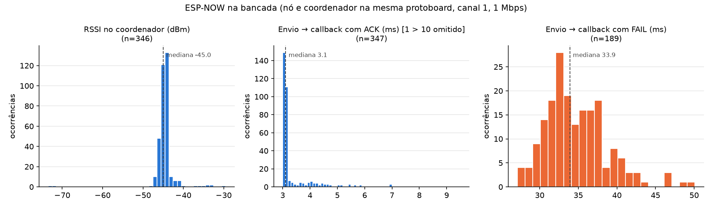

# Comunicação ESP-NOW nó → coordenador

Como o pacote ([`protocolo.md`](protocolo.md)) sai do nó sensor e chega ao coordenador (Etapa 4): o que acontece no ar, a configuração do Wi-Fi, a política de retransmissão, a classificação de cada pacote no coordenador e os testes de bancada.

Fontes principais:

- **[IDF-NOW]** ESP-IDF v5.5, ESP-NOW: <https://docs.espressif.com/projects/esp-idf/en/v5.5/esp32/api-reference/network/esp_now.html>
- **[IDF-WIFI]** ESP-IDF v5.5, Wi-Fi Driver (seção *Long Range*): <https://docs.espressif.com/projects/esp-idf/en/v5.5/esp32/api-guides/wifi.html>
- **[ARD-NOW]** Arduino-ESP32, ESP-NOW: <https://docs.espressif.com/projects/arduino-esp32/en/latest/api/espnow.html>
- Headers do ESP-IDF 5.5.5 instalados pelo pioarduino (`esp_now.h`, `esp_wifi.h`, `esp_wifi_types_generic.h`, `esp_wifi_types_native.h`) e código-fonte do núcleo Arduino-ESP32 3.3.12 (`libraries/WiFi`, `libraries/ESP_NOW`).

## 1. Conceitos

### 1.1 O quadro no ar

O ESP-NOW não usa IP nem associação a um AP. Cada mensagem é um **quadro de gerenciamento 802.11 do subtipo *action*** com a categoria *vendor-specific* (127), que o padrão permite a qualquer estação enviar a qualquer outra [IDF-NOW]:

```
| cabeçalho MAC | categoria | OUI      | aleatório | elemento do fabricante                       | FCS |
|      24       |    127    | 18:FE:34 |     4     | ID 221, comp., OUI, tipo 4, versão, carga útil |  4  |
```

O OUI 18:FE:34 é da Espressif; o valor aleatório *"is used to prevents relay attacks"*; o elemento de tipo 4 identifica o ESP-NOW. Com os 22 bytes do `PacoteLeitura`, o quadro tem 65 bytes e ocupa ~712 µs no ar a 1 Mbps (cálculo em [`protocolo.md`](protocolo.md), seção 9). Um analisador 802.11 em modo monitor mostra esses quadros como *Action / Vendor Specific*.

### 1.2 O "sucesso" do envio é o ACK da camada MAC

> *"It will return ESP_NOW_SEND_SUCCESS in sending callback function if the data is received successfully on the MAC layer. [...] It is not guaranteed that application layer can receive the data."* [IDF-NOW]

O ACK 802.11 é gerado pelo hardware do rádio receptor, um SIFS (10 µs) depois de um quadro unicast com FCS correto, sem passar pelo software. Se ele não chega, a própria camada MAC retransmite o quadro; só depois de esgotar essas retransmissões o callback recebe `ESP_NOW_SEND_FAIL`. A Espressif não documenta quantas retransmissões a MAC faz; a seção 5 mede o tempo até o `FAIL`.

Consequências para o projeto:

1. o ACK prova que o **rádio** do coordenador recebeu o quadro íntegro, não que o pacote chegou ao `loop()` (fila cheia, ESP-NOW ainda não inicializado — observado na seção 6.1 —, pacote inválido ou duplicado também recebem ACK);
2. a entrega **na aplicação** é medida no coordenador pelo par (`boot`, `seq`) ([`protocolo.md`](protocolo.md), seção 6);
3. um ACK de aplicação (o coordenador responder por ESP-NOW) foi descartado: dobraria o tempo de rádio ligado no nó a bateria para cobrir um caso que o `seq` já mede.

### 1.3 Peers, canal e versões

| Item | Valor | Fonte |
|---|---|---|
| Peers no total | 20 (`ESP_NOW_MAX_TOTAL_PEER_NUM`) | `esp_now.h` |
| Peers criptografados | 7 (padrão; máx. 17 recompilando o ESP-IDF) | [IDF-NOW]; `CONFIG_ESP_WIFI_ESPNOW_MAX_ENCRYPT_NUM=7` no `sdkconfig` do núcleo (o header ainda declara 6) |
| Para enviar | o destino precisa estar na lista de peers | `esp_now_send` → `ESP_ERR_ESPNOW_NOT_FOUND` |
| Para receber sem criptografia | não é preciso cadastrar o remetente | [IDF-NOW] |
| Canal do peer | 0 = canal atual; senão, *"must be set as the channel that station or softap is on"* | `esp_now.h` |
| Carga útil | v1.0: 250 B; v2.0: 1470 B; o v2 recebe os dois, o v1 só pacotes ≤ 250 B | [IDF-NOW] |
| Versão no ESP-IDF 5.5.5 | **2** (`esp_now_get_version`, lida no boot do coordenador) | log |

O ESP-NOW transmite e recebe **no canal em que a interface está**; não há varredura. Nó e coordenador precisam estar no mesmo canal (teste na seção 6.5).

### 1.4 Taxa de transmissão e Long Range

*"The default ESP-NOW bit rate is 1 Mbps"* [IDF-NOW] (`WIFI_PHY_RATE_1M_L`, DSSS, o modo 802.11b mais robusto). No ESP-IDF 5.5, a taxa por peer é configurada com `esp_now_set_peer_rate_config()` (`esp_wifi_config_espnow_rate()` está marcada como `deprecated` no header).

O modo **Long Range (LR)**, patenteado pela Espressif, usa taxas de *"1/2 Mbps and 1/4 Mbps"*, tem *"reception sensitivity gain [...] about 4 dB larger than that of the traditional 802.11b mode"* e alcance teórico *"2 to 2.5 times the distance of 11B"*; exige `esp_wifi_set_protocol(..., WIFI_PROTOCOL_LR)` nos dois lados e só funciona entre chips Espressif [IDF-WIFI]. Custo: cada byte ocupa de 2 a 4 vezes mais tempo no ar.

### 1.5 Criptografia

A **PMK** (16 B, uma por aparelho) cifra as LMKs com AES-128; a **LMK** (16 B por peer) cifra o quadro com **CCMP** [IDF-NOW], o AES-CCM do WPA2, que dá confidencialidade, integridade/autenticidade (MIC de 8 B) e proteção contra repetição (número de pacote no cabeçalho CCMP de 8 B). Pelo padrão IEEE 802.11, o CCMP acrescenta 16 B ao quadro: 65 → 81 B, ~712 → ~840 µs a 1 Mbps.

### 1.6 Callbacks e tarefas

- Recepção: `void cb(const esp_now_recv_info_t*, const uint8_t* data, int len)`. O `rx_ctrl` traz `rssi`, `noise_floor` (só no ESP32), `channel`, `rate` e `timestamp` (`esp_wifi_types_native.h`).
- Envio (assinatura nova do ESP-IDF 5.5): `void cb(const esp_now_send_info_t*, esp_now_send_status_t)`.
- Os dois rodam na tarefa do Wi-Fi: *"do not do lengthy operations in the callback function. Instead, post the necessary data to a queue"* [IDF-NOW]. Envios muito próximos *"may lead to disorder of sending callback function"*.

## 2. Decisões

| Decisão | Escolha | Justificativa |
|---|---|---|
| API do ESP-NOW | **`esp_now_*` do ESP-IDF** nos dois firmwares | a biblioteca ESP_NOW do Arduino 3.3.12 não entrega o `esp_now_recv_info_t` (RSSI, ruído) ao `onReceive` dos peers cadastrados, trunca em silêncio envios acima do máximo e exige subclasses de `ESP_NOW_Peer` (*"must be inherited by a child class"*, [ARD-NOW]); a API do ESP-IDF é a documentada em [IDF-NOW] e está no núcleo, sem dependência nova |
| API do Wi-Fi | classe `WiFi` do Arduino (`softAP`, `mode`, `setChannel`) | envelope fino sobre `esp_wifi_*` (conferido no código do núcleo) e base do `WebServer` da etapa 8 |
| Canal | **fixo, canal 1**, em `config.h` dos dois firmwares | 1, 6 e 11 não se sobrepõem; na bancada, a rede mais forte (−18 dBm, canal 9) interfere no 6 e no 11 (seção 3); o coordenador repete a varredura a cada boot (desligável) para justificar o canal também na horta |
| Retransmissão | até **3 envios**, backoff de **10 e 30 ms + 0–10 ms aleatórios** | ver seção 4 |
| `tentativas_ant` | + bit `ANTERIOR_SEM_ACK` em `flags` | desfaz a ambiguidade de "3 tentativas" (entregue na última × desistiu) sem mudar a `VERSAO` ([`protocolo.md`](protocolo.md)) |
| Criptografia | **nenhuma** (decisão do autor, Etapa 4) | ver seção 2.1 |
| MAC fora da tabela de nós | aceito e rastreado como `desconhecido` | um nó novo funciona sem regravar o coordenador; a gravação desses dados é decidida na etapa 7 |
| Taxa | **1 Mbps (padrão)** | o modo mais robusto do 802.11b e o menor tempo no ar entre as opções de longo alcance; o Long Range (seção 1.4) custa 2–4× o tempo de cada byte e exige o protocolo LR nos dois lados. Reavaliar só se o alcance medido na horta não bastar |
| Tempo limite do callback | **100 ms** | 2× o maior `FAIL` medido (49,6 ms); como o `FAIL` sempre chegou antes, reduzir não economiza energia (seção 6.1) |

### 2.1 Criptografia: opções avaliadas

| Critério | Sem criptografia (escolhida) | PMK + LMK por nó (CCMP) |
|---|---|---|
| Leitura dos dados por terceiros | qualquer ESP32 no canal lê | não |
| Injeção de pacotes falsos (MAC forjado) | possível | só com a LMK |
| Repetição de pacotes antigos | `seq` descarta duplicados e antigos no mesmo boot; um `boot` forjado passa como reinício | bloqueada pelo número de pacote do CCMP |
| Tempo no ar (22 B, 1 Mbps) | ~712 µs | ~840 µs (+18 %) |
| Limite de nós | 20 peers | 7 nós cifrados (bibliotecas pré-compiladas) |
| MACs dos nós no coordenador | opcional (nomes) | obrigatórios (peers cifrados) |
| Chaves | — | nos dois firmwares; extraíveis da flash sem *flash encryption* |

Sem criptografia, o sistema confia no isolamento do local e na validação de faixas; os riscos aceitos (leitura e injeção por alguém no alcance do rádio) ficam registrados como limitação. A troca é localizada: `esp_now_set_pmk` e `encrypt = true` com a LMK em `esp_now_add_peer` dos dois lados, com as chaves em `segredos.h`.

## 3. Configuração do Wi-Fi

**Coordenador** ([`radio.cpp`](../coordenador/src/radio.cpp)):

1. `WiFi.persistent(false)`: o núcleo grava a configuração do Wi-Fi na NVS por padrão (`_persistent = true` em `WiFiGeneric.cpp`); desligado para não desgastar a flash a cada boot.
2. Varredura opcional (`VARRER_CANAIS_NO_BOOT`): `WiFi.scanNetworks()` em modo STA; imprime as redes e a ocupação de 1, 6 e 11 (redes a até 4 canais de distância se sobrepõem). Leva ~3,8 s.
3. `WiFi.mode(WIFI_AP)` + `WiFi.softAP(ssid, senha, CANAL_WIFI, 0, 4)`: só AP, o rádio fica fixo no canal; WPA2-PSK (padrão do núcleo); SSID e senha em `segredos.h`, fora do Git (modelo em `segredos.exemplo.h`).
4. `esp_now_init()` e `esp_now_register_recv_cb()`. O callback só copia MAC, RSSI, ruído, canal, instante e bytes (até 250) para uma fila do FreeRTOS de 16 itens (`xQueueSend` com espera 0, nunca bloqueia a tarefa do Wi-Fi); o `loop()` retira, valida e rastreia. Fila cheia conta descarte.

Varredura na bancada (05/10/2026):

| Canal | Redes no canal | Sobrepostas (±4) | Mais forte |
|---|---|---|---|
| 1 | 4 | 5 | −63 dBm |
| 6 | 3 | 10 | −18 dBm |
| 11 | 8 | 5 | −18 dBm |

**Nó** ([`envio.cpp`](../no_sensor/src/envio.cpp)):

1. `WiFi.persistent(false)`, `WiFi.mode(WIFI_STA)` sem `WiFi.begin()`: o rádio liga, mas não procura nem se associa a nenhum AP.
2. `WiFi.setChannel(CANAL_WIFI)` (`esp_wifi_set_channel`, que *"should be called after esp_wifi_start()"*, `esp_wifi.h`).
3. `esp_now_init()`, `esp_now_register_send_cb()` e `esp_now_add_peer()` com o MAC AP do coordenador, `channel = CANAL_WIFI`, `ifidx = WIFI_IF_STA`, sem criptografia.
4. Depois do envio: `esp_now_deinit()` e `WiFi.mode(WIFI_OFF)`, que chama `esp_wifi_stop()` e `esp_wifi_deinit()`: cada ciclo liga o Wi-Fi do zero, como depois do deep sleep (etapa 5).

## 4. Envio e retransmissão

```
 NÓ (loop)                    NÓ (tarefa Wi-Fi / rádio)              COORDENADOR (rádio)     COORDENADOR (software)
 ─────────                    ────────────────────────               ───────────────────     ──────────────────────
 ler sensores, montar (seq++)
 ligar Wi-Fi + ESP-NOW + peer
 esvazia fila de confirmação
 esp_now_send ──────────────► espera canal livre (DIFS + backoff)
                              quadro action 65 B (~0,7 ms) ────────► FCS ok
                                                                    ◄──── ACK 802.11 (SIFS)
                              [sem ACK: a MAC retransmite sozinha]   └─► callback de recepção ─► fila ─► loop(): validar,
                              callback de envio                                                          classificar, CSV
 espera a confirmação ◄────── (SUCCESS ou FAIL) pela fila de 1 item
   SUCCESS → fim
   FAIL ou sem callback em 100 ms → espera 10 ms (+0–10) → 2ª tentativa
   FAIL de novo → espera 30 ms (+0–10) → 3ª tentativa → desiste
 guarda tentativas e ANTERIOR_SEM_ACK na RAM do RTC
 desliga Wi-Fi; espera o próximo ciclo
```

Política ([`config.h`](../no_sensor/src/config.h)):

| Parâmetro | Valor | Por quê |
|---|---|---|
| `MAX_ENVIOS` | 3 | a MAC já faz as retransmissões rápidas; as da aplicação cobrem falhas de dezenas de ms (interferência, canal ocupado) sem gastar bateria à toa quando o coordenador está fora |
| `BACKOFF_MS` | 10, 30 | espera crescente: dá tempo de a causa passar |
| `SORTEIO_MS` | 0–10 (`esp_random`) | dois nós que acordam juntos e colidem não repetem a colisão no mesmo instante |
| `TEMPO_LIMITE_CALLBACK_MS` | 100 | só protege contra um callback que nunca chega; o `FAIL` chega em ~30–47 ms (seção 6) |

Cuidados de implementação:

- a confirmação passa do callback para o `loop()` por uma fila de 1 item (`xQueueOverwrite` no callback, `xQueueReceive` com tempo limite no `loop()`), esvaziada antes de cada tentativa: um callback atrasado não é tomado pelo da tentativa seguinte;
- o `seq` avança mesmo se o envio falhar: a falha aparece no coordenador como perda;
- `tentativas_ant` e `ANTERIOR_SEM_ACK` vão no pacote **seguinte**; o coordenador cruza com o `seq` para separar falha no rádio (bit ligado, `seq` anterior ausente) de perda depois do ACK (bit desligado, `seq` anterior ausente).

## 5. Rastreamento no coordenador

[`nos.cpp`](../coordenador/src/nos.cpp) mantém uma tabela fixa de até 8 nós, indexada pelo MAC de origem, com o `RastreadorSequencia` de `comum/protocolo` e contadores. O nome vem de `config::NOS` (MAC STA → nome); MAC fora da lista vira `desconhecido`.

### Instrumentação (linhas na serial)

Coordenador, uma linha por quadro recebido (válido ou não):

```
[CSV] t_ms,mac,nome,rssi,ruido,len,validacao,classe,perdidos,boot,seq,temp_c100,ur_c100,solo_mv,alim_mv,estados,motivo_boot,acordado_ant_ms,tent_ant,flags
```

Coordenador, por nó a cada 60 s:

```
[RESUMO] t_ms,mac,nome,recebidos,rejeitados,aceitos,perdidos,descartados,reinicios,sem_ack,entrega_pct,rssi_medio,rssi_min,rssi_max
```

Nó, uma linha por ciclo (tempos em µs; `tK_us` = do `esp_now_send` ao callback da tentativa K, −1 sem callback no prazo):

```
[ENVIO] boot,seq,ack,tentativas,ligar_us,t1_us,t2_us,t3_us,envio_us,erro,tent_ant,flags,leitura_us,ciclo_us
```

## 6. Testes de bancada

**Bancada, 05/10/2026.** COORD e NÓ 1 na mesma protoboard, canal 1, 1 Mbps, sem criptografia, um pacote a cada 2 s. São medições para validar o firmware e a instrumentação; alcance e taxa de entrega reais virão da horta.

Método: [`ferramentas/capturar_seriais.py`](../ferramentas/capturar_seriais.py) grava as duas seriais ao mesmo tempo (instante do PC em cada linha) e comanda o pino EN de cada placa pela linha RTS da ponte USB (reiniciar o nó; manter o coordenador em reset = "desligado"). [`ferramentas/analisar_comunicacao.py`](../ferramentas/analisar_comunicacao.py) cruza as linhas `[ENVIO]` do nó com as `[CSV]` do coordenador pelo par (`boot`, `seq`). Dados brutos em [`dados/etapa4/brutos/`](../dados/etapa4/brutos/) (SSIDs das redes vizinhas omitidos); saída completa da análise em [`dados/etapa4/resumo_testes.md`](../dados/etapa4/resumo_testes.md). Abrir a porta serial reinicia as duas placas, então cada captura começa com o coordenador subindo (~5 s, com a varredura): os pacotes desse intervalo ficam fora da "janela com o coordenador no ar".



### Resumo

| Teste | Como | Esperado | Resultado |
|---|---|---|---|
| 1. Entrega | 620 s, 310 pacotes | todos entregues | **307/307 (100 %)** com o coordenador no ar, todos na 1ª tentativa; 0 perdas, 0 descartes de fila |
| 2. Coordenador desligado | COORD em reset dos 30 aos 90 s | o nó tenta, desiste e segue | 36 ciclos com 3 tentativas, todas com `FAIL` por callback (0 sem callback); ciclo não atrasou; o 1º pacote depois da volta chegou com `tent_ant=3` e `ANTERIOR_SEM_ACK` |
| 3. Reinício do nó | 3 resets pelo EN | reinício, não perda | 3 × `reinicio` (boot 11, 12, 13; `seq` 0), **0 perdidos** |
| 4. Duplicata | env `teste_duplicata`: a cada 5 ciclos, reenvia o pacote atual e o anterior | `duplicado` e `antigo`, descartados | 7 `duplicado` + 7 `antigo`, todos descartados; 0 perdidos; **os 14 reenvios receberam ACK** |
| 5a. Canal errado (6) | env `teste_canal6` | falha | **0/25** pacotes, 75 tentativas com `FAIL`; coordenador não recebeu nada |
| 5b. Canal adjacente (2) | env `teste_canal2` | falha | **funcionou**: 22 recebidos, RSSI −48 dBm (seção 6.5) |

### 6.1 Tempos no nó

| Grandeza | Mediana | p95 | Mín–máx | n |
|---|---|---|---|---|
| Envio → callback com ACK | **3,10 ms** | 5,45 ms | 3,05–30,8 ms | 308 (teste 1) |
| Envio → callback com `FAIL` | **33,9 ms** | — | 27,6–49,6 ms | 189 (testes 1, 2, 5a) |
| Ligar Wi-Fi + ESP-NOW + peer, 1º ciclo do boot | **96 ms** | — | 94,7–114,5 ms | 9 boots |
| Ligar Wi-Fi + ESP-NOW + peer, demais ciclos | **19,2 ms** | 19,2 ms | 19,1–19,9 ms | 309 (teste 1) |
| Ciclo acordado (ler + ligar + enviar + desligar) | **130,6 ms** | 132,6 ms | — | 310 (teste 1) |
| Ciclo acordado com o coordenador fora (3 × `FAIL`) | ~280 ms | — | 268–296 ms | teste 2 |

Leitura:

1. **O sucesso leva ~3 ms**, contra ~1 ms de quadro + ACK no ar: o restante é a pilha de software (fila do Wi-Fi, acesso ao meio, callback).
2. **O `FAIL` chega por callback em 28–50 ms**, nunca pelo tempo limite. Sem ACK, a camada MAC retransmite o quadro sozinha durante esse tempo — dezenas de tentativas de ~1 ms com espera aleatória crescente; o número exato não é documentado pela Espressif. Por isso o tempo limite de 100 ms (2× o maior `FAIL` medido) é só uma rede de segurança.
3. Com o coordenador fora, cada ciclo gasta ~150 ms a mais de rádio (3 tentativas × ~34 ms + backoffs). É o custo da política de retransmissão; com a 1ª tentativa sozinha já cobrindo 100 % na bancada, as retransmissões só pagam quando há interferência real (a medir na horta).
4. **O 1º ciclo de cada boot leva ~96 ms para ligar o rádio; os seguintes, ~19 ms.** O núcleo usa a calibração parcial de RF (`CONFIG_ESP_PHY_RF_CAL_PARTIAL=y`), feita na 1ª inicialização do PHY depois do boot com os dados guardados na NVS; nos ciclos seguintes o PHY já está calibrado. Depois do deep sleep, o ESP-IDF usa *"no calibration"* ([RF calibration, ESP-IDF v5.5](https://docs.espressif.com/projects/esp-idf/en/v5.5/esp32/api-guides/RF_calibration.html)) — a medir na etapa 5.

### 6.2 Enlace (coordenador)

| Grandeza | Mediana | p5–p95 | Mín–máx |
|---|---|---|---|
| RSSI | −45 dBm | −46 a −42 dBm | −73 a −33 dBm |
| Piso de ruído | −96 dBm | — | constante |
| SNR (RSSI − ruído) | 51 dB | 50–54 dB | 23–63 dB |

Os extremos (−73 e −33 dBm) são casos isolados que coincidem com movimento perto das placas; por isso o RSSI é resumido por mediana e percentis, não só pela média.

### 6.3 ACK da camada MAC ≠ entrega na aplicação (observado)

Dois casos reais, além da afirmação da documentação (seção 1.2):

- **Boot do coordenador (teste 1):** o SoftAP subiu em 4,75 s e o ESP-NOW ficou pronto em 5,00 s. Um pacote enviado nesse intervalo (seq 2) recebeu ACK depois de 30,8 ms de retransmissões, mas não chegou à aplicação: o rádio já respondia ao MAC AP, e o ESP-NOW ainda não estava inicializado. Janela de ~0,25 s, só no boot do coordenador.
- **Duplicatas (teste 4):** os 14 reenvios receberam ACK; o coordenador os descartou na aplicação, como devia.

Só o rastreamento por (`boot`, `seq`) no coordenador mede a entrega real.

### 6.4 Coordenador desligado

O nó não trava: cada ciclo termina em ~280 ms e o próximo começa no horário. O pacote que chega depois da volta traz `tent_ant = 3` e `ANTERIOR_SEM_ACK`, o histórico de falha visto pelo nó. Como o coordenador reiniciou, esse pacote é `primeiro` e as perdas da janela não são contadas no coordenador — limitação já prevista em [`protocolo.md`](protocolo.md), seção 6; na operação, ela se limita ao tempo em que o coordenador está fora do ar.

### 6.5 Canal errado e canal adjacente

- **Canal 6** (nó) × canal 1 (coordenador): nenhum quadro recebido, `FAIL` em todas as tentativas, `esp_now_send` sem erro (o nó está coerente com o próprio canal). Confirma que o ESP-NOW exige o mesmo canal nos dois lados.
- **Canal 2**: funcionou, com RSSI ~3 dB menor. No 802.11b (DSSS) cada canal ocupa 22 MHz com centros espaçados de 5 MHz, e o receptor no canal 1 ainda capta o quadro transmitido no canal 2 quando o sinal é forte. **Consequência:** um erro de canal de ±1 passaria despercebido na bancada e apareceria só no campo, sem margem de sinal. Por isso o canal é uma constante única em cada `config.h` e é impresso no boot das duas placas.

## 7. Pendências

- **Long Range:** reavaliar com os dados de alcance da horta (RSSI/SNR por distância); a taxa fica em 1 Mbps até lá.
- **NÓ 2:** a terceira placa ainda não foi conectada; falta o teste com 2 nós simultâneos (sem sensores, deve enviar estados `erro`).
- **Janela do boot do coordenador** (seção 6.3): opcional, inicializar o ESP-NOW antes de configurar o SoftAP.
- **Criptografia:** desligada por decisão; a troca para PMK/LMK está descrita na seção 2.1.
