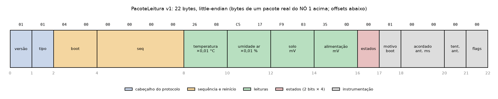
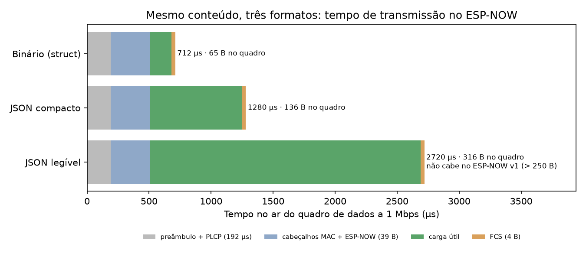

# Protocolo de aplicação nó → coordenador

Formato dos bytes que o nó sensor envia ao coordenador pelo ESP-NOW (Etapa 3). Definido uma única vez em [`comum/protocolo/src/protocolo.h`](../comum/protocolo/src/protocolo.h), incluído pelos dois firmwares; testado sem rádio no PC (`cd no_sensor && pio test -e native`).

**Versão 1: `PacoteLeitura`, 22 bytes, binário, little-endian.**



## 1. Decisões e justificativas

| Decisão | Escolha | Por quê |
|---|---|---|
| Codificação | binário de tamanho fixo (`struct` packed) | a 1 Mbps cada byte custa 8 µs no ar e energia do nó; o JSON fica para a API HTTP do coordenador (seção 9) |
| Números | inteiros escalados, sem `float` | 2 bytes no lugar de 4, sem `NaN`, comparação exata; ×100 dá 0,01 °C, a resolução do AHT20 |
| Identificação do nó | **MAC de origem** (sem campo de id) | o callback de recepção já entrega o `src_addr`; todos os nós usam o mesmo binário; o coordenador mantém a tabela MAC → nome e calibração |
| Sequência | `seq` uint32 na RAM do RTC + `boot` uint16 na NVS | o par (`boot`, `seq`) nunca se repete; separa perda, duplicata e reinício (seção 6) |
| Umidade do solo | **tensão em mV**; o % é calculado no coordenador | recalibrar no campo sem regravar os nós; o histórico guarda o dado bruto |
| Estados | 2 bits por grandeza, num único byte | `ok`, `erro`, `fora_de_faixa` (+1 valor reservado) |
| Instrumentação | tempo acordado e tentativas do ciclo anterior, motivo do boot, flags | consumo, taxa de entrega e diagnóstico em campo por 5 bytes (40 µs no ar) |
| Checksum próprio | **nenhum** | o quadro 802.11 já tem FCS (CRC-32); estrutura conferida por versão, tamanho e faixas; autenticidade fica para a criptografia (etapa 4) |
| Horário | **não vai no pacote** | o nó não tem relógio; o coordenador marca data e hora (DS3231) ao receber. Os únicos campos de tempo são durações medidas pelo contador interno do nó |

## 2. Conceitos e fontes

- **Tipos de tamanho fixo** (`<cstdint>`): `long` tem 4 bytes no ESP32 e 8 no PC x86-64 (medido com `static_assert` nos dois compiladores), então o pacote usa só `uint8_t`, `int16_t`, `uint16_t` e `uint32_t`.
- **Padding e `packed`:** sem `packed`, o compilador insere bytes de alinhamento. O GCC define que o atributo faz cada membro ser *"placed to minimize the memory required"* ([GCC, Common Attributes](https://gcc.gnu.org/onlinedocs/gcc/Common-Attributes.html)). A ordem dos campos foi escolhida para que todos fiquem **naturalmente alinhados** (cada campo de *n* bytes num offset múltiplo de *n*): não há enchimento interno, e sem `packed` o compilador acrescentaria só 2 bytes no fim (24 bytes), o que o `static_assert` detecta.
- **Acesso desalinhado:** no ESP32, uma leitura de 16/32 bits num endereço desalinhado gera a exceção *LoadStoreAlignment* ([ESP-IDF, Fatal Errors](https://docs.espressif.com/projects/esp-idf/en/v5.5/esp32/api-guides/fatal-errors.html)). Regras: nunca pegar ponteiro para um campo do pacote; o pacote recebido é copiado com `memcpy` para uma variável local (`validar()`).
- **Endianness:** o ESP32 é little-endian (`XCHAL_HAVE_BE 0` em `xtensa/config/core-isa.h`; o `xtensa-esp32-elf-gcc` define `__XTENSA_EL__`), assim como o PC dos testes. **Todos os campos multibyte são little-endian.** Para ler o pacote em Python: `struct.unpack('<BBHIhHHHBBHBB', dados)`.
- **Carga máxima do ESP-NOW v1.0:** 250 bytes ([ESP-NOW, ESP-IDF v5.5](https://docs.espressif.com/projects/esp-idf/en/v5.5/esp32/api-reference/network/esp_now.html)), travada por `static_assert`.

## 3. Campos

| Offset | Campo | Tipo | Bytes | Unidade / escala | Faixa válida |
|---|---|---|---|---|---|
| 0 | `versao` | uint8 | 1 | — | = 1 |
| 1 | `tipo` | uint8 | 1 | 1 = leitura | = 1 |
| 2 | `boot` | uint16 | 2 | contador de boots do nó (NVS) | 0–65535 (dá a volta) |
| 4 | `seq` | uint32 | 4 | nº do pacote no boot; o 1º é 0 | 0–4 294 967 295 (dá a volta) |
| 8 | `temperatura_c100` | int16 | 2 | 0,01 °C | −4000 a 8500 (−40 a 85 °C, AHT20 tab. 2) |
| 10 | `umidade_ar_c100` | uint16 | 2 | 0,01 %UR | 0 a 10000 (AHT20 tab. 1) |
| 12 | `solo_mv` | uint16 | 2 | mV na saída do sensor | 0 a 3300 |
| 14 | `alimentacao_mv` | uint16 | 2 | mV na entrada do divisor | 0 a 6000 |
| 16 | `estados` | uint8 | 1 | 2 bits por grandeza | sem o valor 3 |
| 17 | `motivo_boot` | uint8 | 1 | `esp_reset_reason()` | 0–15 no ESP-IDF 5.5 (outros aceitos) |
| 18 | `acordado_ant_ms` | uint16 | 2 | ms acordado no ciclo anterior | 0 = desconhecido |
| 20 | `tentativas_ant` | uint8 | 1 | envios (`esp_now_send`) do pacote anterior | 0 = desconhecido |
| 21 | `flags` | uint8 | 1 | bit 0: o AHT20 precisou de nova tentativa; bit 1: o pacote anterior esgotou as tentativas sem ACK (`ANTERIOR_SEM_ACK`, Etapa 4); bits 2–7 reservados (enviados como 0, ignorados) | — |
| | **total** | | **22** | | |

**Campo `estados`:**

```
bit:    7  6 |  5  4 |  3  2 |  1  0
     alimentação | solo | umidade ar | temperatura

00 = ok   01 = erro (valor enviado como 0, ignorar)   10 = fora_de_faixa   11 = reservado (inválido)
```

**`motivo_boot`** ([ESP-IDF, misc system API](https://docs.espressif.com/projects/esp-idf/en/v5.5/esp32/api-reference/system/misc_system_api.html)): 1 = `POWERON` (no ESP32 inclui o reset pelo pino EN), 3 = `SW`, 4 = `PANIC`, 5–7 = watchdogs, 8 = `DEEPSLEEP`, 9 = `BROWNOUT` (bateria fraca), 14 = `PWR_GLITCH`, 15 = `CPU_LOCKUP`.

**`tentativas_ant` e `ANTERIOR_SEM_ACK`** (definidos na Etapa 4, [`comunicacao.md`](comunicacao.md)): `tentativas_ant` conta quantas vezes o nó chamou `esp_now_send` para o pacote anterior. Sozinho, o valor máximo seria ambíguo (entregue na última tentativa ou desistiu?); o bit `ANTERIOR_SEM_ACK` de `flags` diz que nenhuma tentativa recebeu o ACK da camada MAC. Cruzado com o `seq` no coordenador, separa a falha no rádio (bit ligado, `seq` anterior ausente) da perda depois do ACK (bit desligado, `seq` anterior ausente: fila ou validação no coordenador). Usar um bit até então reservado não muda a `VERSAO`: coordenadores anteriores já o ignoravam. Ambos valem 0 no primeiro pacote depois de ligar (a RAM do RTC zera no *power-on*).

### Exemplo real (NÓ 1, 05/10/2026), conferido com a linha CSV do mesmo ciclo

```
01 01 04 00 00 00 00 00 26 08 C5 17 F9 03 35 0D 00 01 00 00 00 00
```

| Offset | Bytes | Campo | Valor | Leitura do ciclo |
|---|---|---|---|---|
| 0 | `01` | versao | 1 | — |
| 1 | `01` | tipo | leitura | — |
| 2 | `04 00` | boot | 4 | — |
| 4 | `00 00 00 00` | seq | 0 | — |
| 8 | `26 08` | temperatura | 0x0826 = 2086 → 20,86 °C | 20,86 °C |
| 10 | `C5 17` | umidade_ar | 0x17C5 = 6085 → 60,85 % | 60,85 % |
| 12 | `F9 03` | solo | 0x03F9 = 1017 mV | 1017,0 mV |
| 14 | `35 0D` | alimentação | 0x0D35 = 3381 mV | 3381 mV |
| 16 | `00` | estados | todos ok | todos ok |
| 17 | `01` | motivo_boot | POWERON | — |
| 18 | `00 00` | acordado_ant_ms | desconhecido (sem deep sleep ainda) | — |
| 20 | `00` | tentativas_ant | desconhecido (sem rádio ainda) | — |
| 21 | `00` | flags | — | aht20_extras = 0 |

## 4. Montagem no nó (`montarLeitura`)

Recebe as leituras em unidades naturais (como saem de `sensores::lerTodas()`) e:

1. multiplica pela escala e arredonda para o inteiro mais próximo (meio para longe do zero);
2. verifica a faixa válida **antes** de saturar: com estado `ok` e valor fora da faixa, o estado passa a `fora_de_faixa` (ex.: −1 % é saturado em 0 e continua fora de faixa);
3. satura no limite do tipo o que não couber (ex.: 400 °C → 32767);
4. estado `erro`, valor `NaN` ou estado `reservado` na entrada → valor 0 e estado `erro`.

Contadores no nó ([`no_sensor/src/contadores.cpp`](../no_sensor/src/contadores.cpp)):

- `boot`: lido e incrementado na NVS (biblioteca `Preferences`, [Arduino-ESP32](https://docs.espressif.com/projects/arduino-esp32/en/latest/api/preferences.html)) em todo início que **não** seja o despertar do deep sleep. Uma escrita na flash por boot, nunca por ciclo; a NVS tem distribuição de desgaste própria ([NVS, ESP-IDF](https://docs.espressif.com/projects/esp-idf/en/v5.5/esp32/api-reference/storage/nvs_flash.html)).
- `seq`: em `RTC_DATA_ATTR`, que *"will keep its value during a deep sleep / wake cycle"* (`esp_attr.h`, ESP-IDF 5.5) e volta a 0 em qualquer outro reset.

## 5. Validação no coordenador (`validar`)

Verificações, nesta ordem; a primeira que falhar define o motivo, e o pacote é descartado e registrado.

| # | Verificação | Motivo registrado |
|---|---|---|
| 1 | ponteiro nulo ou menos de 2 bytes | `tamanho_curto` |
| 2 | `versao` ≠ 1 | `versao_desconhecida` |
| 3 | `tipo` ≠ 1 | `tipo_desconhecido` |
| 4 | tamanho ≠ 22 | `tamanho_errado` |
| 5 | algum estado = 3 | `estado_reservado` |
| 6 | estado `ok` com valor fora da faixa (seção 3) | `temperatura_fora`, `umidade_ar_fora`, `solo_fora`, `alimentacao_fora` |

- Versão e tipo vêm antes do tamanho exato: um nó com firmware novo (outra versão, outro tamanho) aparece como `versao_desconhecida`, o diagnóstico útil.
- Valores com estado `fora_de_faixa` ou `erro` não são verificados (o nó já os marcou).
- Bits reservados de `flags` e valores desconhecidos de `motivo_boot` são **aceitos**, para compatibilidade com versões futuras.

## 6. Sequência, duplicatas e reinício (`RastreadorSequencia`)

Um rastreador por nó (MAC) no coordenador classifica cada pacote válido:

| Situação | Classe | Ação |
|---|---|---|
| primeiro pacote do nó desde que o coordenador ligou | `primeiro` | aceita; histórico anterior desconhecido, sem contar perdas |
| mesmo `boot`, `seq` posterior ao último | `novo` | aceita; `seq − último − 1` pacotes **perdidos** |
| mesmo `boot` e mesmo `seq` | `duplicado` | descarta |
| mesmo `boot`, `seq` anterior ao último | `antigo` | descarta |
| `boot` diferente do último (maior ou menor) | `reinicio` | aceita; conta reinício; os `seq` anteriores a este no novo boot contam como perdidos |

- **Volta do contador:** a comparação de `seq` usa aritmética modular de 32 bits (como o RFC 1982): depois de 0xFFFFFFFF vem 0, classificado como `novo`, sem confundir com reinício. A 1 pacote por minuto, a volta levaria ~8000 anos; o teste existe por correção.
- **Por que qualquer `boot` diferente é reinício:** a NVS do nó pode ser apagada (gravação com apagamento total) e o contador recomeçar em 1. Tratar "boot menor" como pacote antigo travaria o nó para sempre.
- **Limitação:** perdas no fim de um boot (antes de o nó reiniciar) não são detectáveis.
- **Taxa de entrega** (avaliação): `aceitos / (aceitos + perdidos)` por nó.

## 7. Umidade do solo no coordenador

O coordenador guarda, por MAC, os pontos de calibração (`mv_seco`, `mv_umido`) e calcula `% = (mv_seco − mv) / (mv_seco − mv_umido) × 100`, limitado a 0–100. Valores de bancada: 1400 e 655 mV ([`sensores.md`](sensores.md), seção 4.3). Sem calibração cadastrada para um nó, mostra só a tensão.

## 8. Integridade

- Todo quadro 802.11 termina com o **FCS (CRC-32)**, que aparece no formato do quadro ESP-NOW na documentação da Espressif. Pelo padrão IEEE 802.11, o receptor descarta quadros com FCS inválido antes de entregá-los ao software.
- O ESP-NOW não acrescenta outro CRC na parte do fabricante.
- Um checksum próprio só detectaria erros introduzidos depois da recepção (bugs); contra isso existem a versão, o tamanho exato e a validação de faixas. Contra adulteração, a proteção certa é a criptografia do ESP-NOW (etapa 4), e não um checksum.

## 9. Overhead no ar

**Quadro ESP-NOW v1.0** ([ESP-IDF v5.5, Frame Format](https://docs.espressif.com/projects/esp-idf/en/v5.5/esp32/api-reference/network/esp_now.html)):

```
| cabeçalho MAC | categoria | OUI | aleatório | elemento do fabricante          | FCS |
|      24       |     1     |  3  |     4     | ID 1, comp. 1, OUI 3, tipo 1,   |  4  |
|               |           |     |           | versão 1, corpo = carga útil    |     |
                         → 43 bytes fixos + carga útil
```

**Camada física:** taxa padrão do ESP-NOW de 1 Mbps (`WIFI_PHY_RATE_1M_L`, *"1 Mbps with long preamble"*); preâmbulo longo + cabeçalho PLCP = 192 µs (IEEE 802.11, camada DSSS). Tempo no ar = 192 µs + 8 µs por byte do quadro.

**Energia:** corrente típica de transmissão 802.11b DSSS 1 Mbps a +19,5 dBm = 240 mA (ESP32 Series Datasheet v5.3, tab. 5-4). Carga do rádio = 240 mA × tempo no ar.

| Formato (mesmo conteúdo) | Carga útil | Quadro | Tempo no ar | Carga do rádio | Carga útil / quadro | Cabe no ESP-NOW v1? |
|---|---|---|---|---|---|---|
| **Binário (`PacoteLeitura`)** | **22 B** | **65 B** | **712 µs** | **171 µC** | 34 % | sim |
| JSON compacto (`{"v":1,"t":1,…}`) | 93 B | 136 B | 1280 µs | 307 µC | 68 % | sim |
| JSON legível (`{"versao":1,…}`) | 273 B | 316 B | 2720 µs | 653 µC | 86 % | **não** |
| JSON compacto, pior caso | 117 B | 160 B | 1472 µs | 353 µC | 73 % | sim |
| JSON legível, pior caso | 339 B | 382 B | 3248 µs | 780 µC | 89 % | **não** |



Leitura dos resultados:

1. **O binário transmite em 712 µs, 1,8× mais rápido que o JSON compacto e 3,8× mais rápido que o JSON legível**, com a mesma informação. O JSON legível nem cabe no limite de 250 bytes do ESP-NOW v1.
2. A eficiência do binário (34 %) parece baixa porque **o custo fixo domina**: o preâmbulo (192 µs) e os 43 bytes de cabeçalho (344 µs) somam 536 µs, 75 % do tempo do quadro. Por isso cortar mais 2 ou 3 bytes da carga útil não valeria a perda de clareza.
3. A transmissão confirmada inclui o ACK do coordenador (14 bytes: 304 µs) após o SIFS (10 µs): **~1026 µs por pacote entregue**, sem contar a espera de acesso ao canal (DIFS e backoff aleatório).
4. Por ciclo, o rádio gasta ~0,17 mC transmitindo o pacote. É pouco perto do tempo que o rádio fica ligado para iniciar o Wi-Fi e esperar o ACK; o consumo total por ciclo será medido na etapa 5.

Script: [`ferramentas/overhead_protocolo.py`](../ferramentas/overhead_protocolo.py) (gera a tabela e as duas figuras).

## 10. Testes

`cd no_sensor && pio test -e native`: 26 testes Unity no PC ([Unity no PlatformIO](https://docs.platformio.org/en/latest/advanced/unit-testing/frameworks/unity.html)), em [`no_sensor/test/test_protocolo/`](../no_sensor/test/test_protocolo/test_main.cpp):

| Grupo | O que cobre |
|---|---|
| Layout | tamanho de 22 bytes; os 22 bytes esperados, em little-endian, de um pacote montado |
| Montagem | bits de estado; limites exatos das faixas (−40,00 e 85,00 °C) e um passo além; saturação; umidade negativa; `erro`, `NaN`, `reservado` e infinito |
| Validação | ida e volta montar → validar; buffer em endereço ímpar; tamanho curto, versão desconhecida (inclusive com outro tamanho), tipo desconhecido, tamanho errado, estado reservado, cada faixa com estado `ok`; valores aceitos com `fora_de_faixa`/`erro`; flags e motivo desconhecidos aceitos; bit `ANTERIOR_SEM_ACK` preservado |
| Sequência | sequência normal e lacuna; primeiro pacote; duplicado e antigo; reinício × duplicata; boot menor; estouro de `seq` com e sem lacuna |

## 11. Evolução

Qualquer mudança de campo, tamanho ou significado exige **incrementar `VERSAO`** e atualizar este documento, os `static_assert` e os testes. Um coordenador antigo descarta pacotes de versão nova com o motivo `versao_desconhecida`, em vez de interpretar bytes errados. Tipos novos de mensagem (ex.: "nó iniciou") usam o campo `tipo`, com structs próprias que começam pelos mesmos dois bytes (`versao`, `tipo`).
